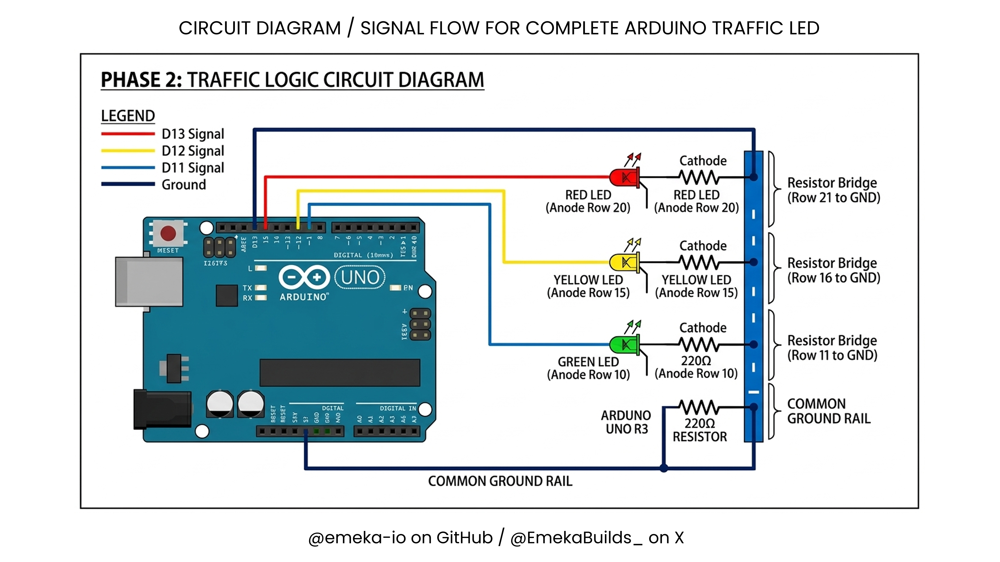

# Arduino Traffic Logic - Phase 1 & 2
### My first complete Arduino project

## Live Demo
See the full 3-LED sequence blinking here: [Link to my X post](https://x.com/EmekaBuilds_/status/2041866171729760302?s=20)

See the full single LED blinking here: [Link to my X post](https://x.com/EmekaBuilds_/status/2040008618154627471?s=20)

## Circuit Diagrams
This layout maps the signal flow for the full traffic system.

While, this layout maps the signal flow for the single LED (green).

## Physical Build
The evolution from a single green LED test to a full Traffic Light system.

### Phase 2: Complete Traffic Light

### Phase 1: Initial Green LED Test

## Hardware Setup
- **Microcontroller:** Arduino Uno R3
- **Components:** 3 LEDs (Red, Yellow, Green)
- **Breadboard:** Shared Blue Rail for common grounding.
- **Protection:** 3x 220Ω Resistors (One per LED to prevent burnout).

## Wiring Configuration
| LED Color | Arduino Pin | Breadboard Row |
| :--- | :--- | :--- |
| **Green** | Pin 11 | Row 10 |
| **Yellow** | Pin 12 | Row 15 |
| **Red** | Pin 13 | Row 20 |
| **Ground** | GND | Blue Rail (-) |

## Logic & Timing
The system uses a sequential loop:
1. **Green:** 5000ms (5 seconds)
2. **Yellow:** 2000ms (2 seconds)
3. **Red:** 5000ms (5 seconds)
